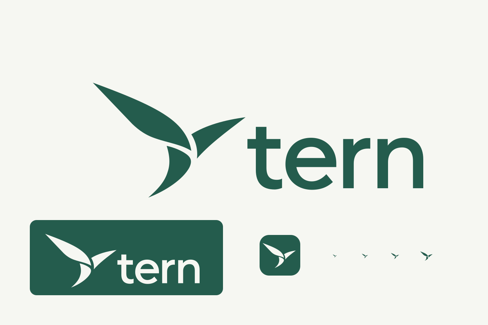

# Tern identity

The approved mark suggests a tern banking in flight, drawn with three tapered shapes and an open cut between them. The lowercase wordmark is outlined, with no font dependency. Forest green is `#245C4D` and paper is `#F6F7F2`.

## Source and exports

`tern-master.svg` is the production vector master, reconstructed from the approved `tern-v2-concept.png`. Edit its `glyph` and `lettering` groups, then run `npm run brand:generate` at the repository root. This needs librsvg's `rsvg-convert`; ordinary application builds use the checked-in exports and do not need it.

The generator updates this directory and the assets in `packages/app/public`, `prototype/public`, `website/public`, and `desktop/resources`. Desktop and future mobile builds use the shared app assets. Do not edit generated copies independently. The social preview is a separate imagegen asset in `website/public/og.png`; its prompt is recorded in `social-preview-prompt.txt`.

| Asset | Use |
| --- | --- |
| `tern-glyph.svg` | Green glyph on transparent background |
| `tern-glyph-inverse.svg` | Ivory glyph for dark backgrounds |
| `tern-glyph-mono.svg` | Inherits `currentColor` when inline; usable as a CSS mask |
| `tern-wordmark.svg` | Green glyph and outlined lettering |
| `tern-wordmark-inverse.svg` | Ivory wordmark for dark backgrounds |
| `tern-wordmark-mono.svg` | Single-colour wordmark for theme-aware CSS masks |
| `tern-icon.svg` | Ivory glyph on a green rounded square |
| `tern-icon-{size}.png` | App icons at 16, 24, 32, 48, 64, 128, 180, 256, 512, and 1024 pixels |
| `tern-glyph.png`, `tern-wordmark.png` | Transparent raster exports |
| `preview.svg`, `preview.png` | Production identity review sheet |

Use the glyph in empty states and compact controls, the app icon for launchers and favicons, and the full wordmark in headers. Preserve the proportions, clear space, and negative-space cuts. On themed desktop surfaces, the logo follows the foreground colour and decorative glyphs follow the accent colour.

For an image beside visible Tern text, use an empty `alt` attribute. A standalone wordmark needs the accessible name `Tern`; a linked homepage logo needs `Tern home`.

The concept image and imagegen prompts document the approved direction. Production assets use solid fills and clean vector curves.
