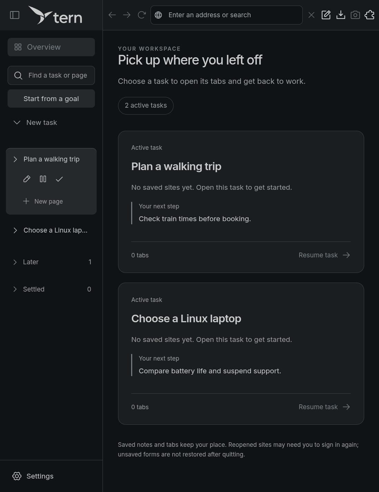
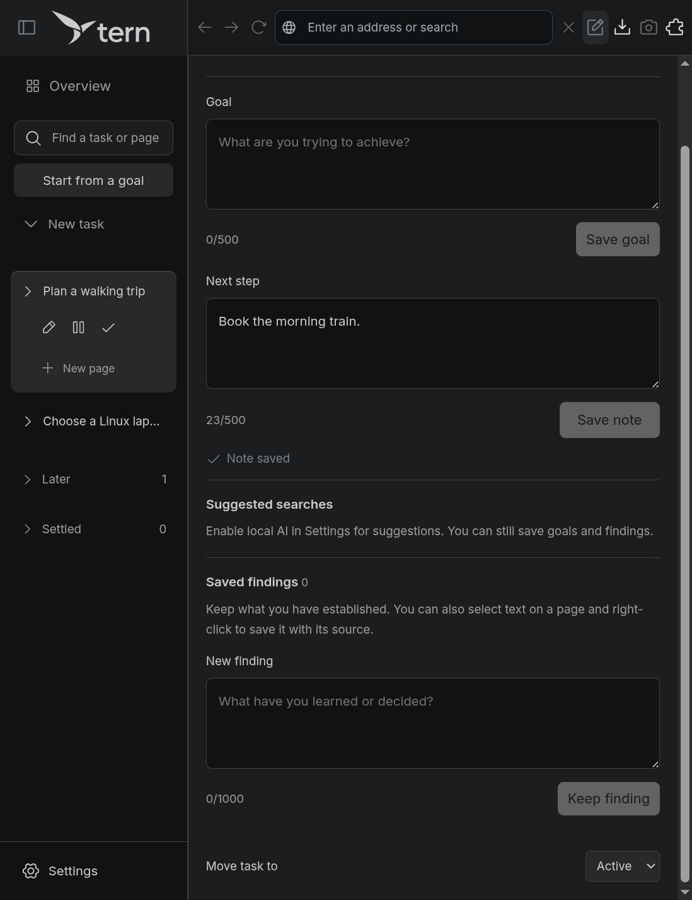
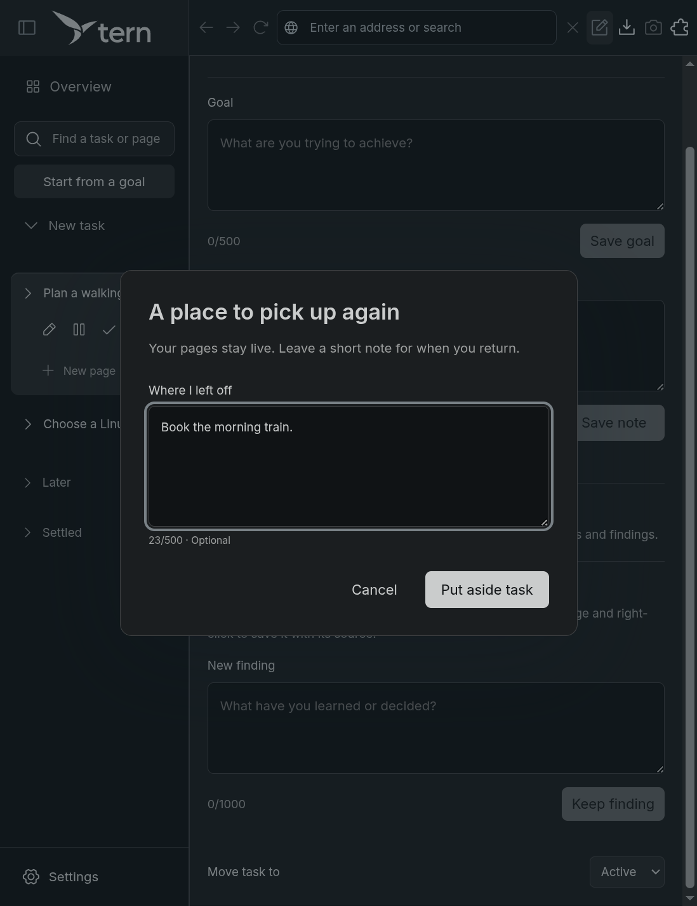
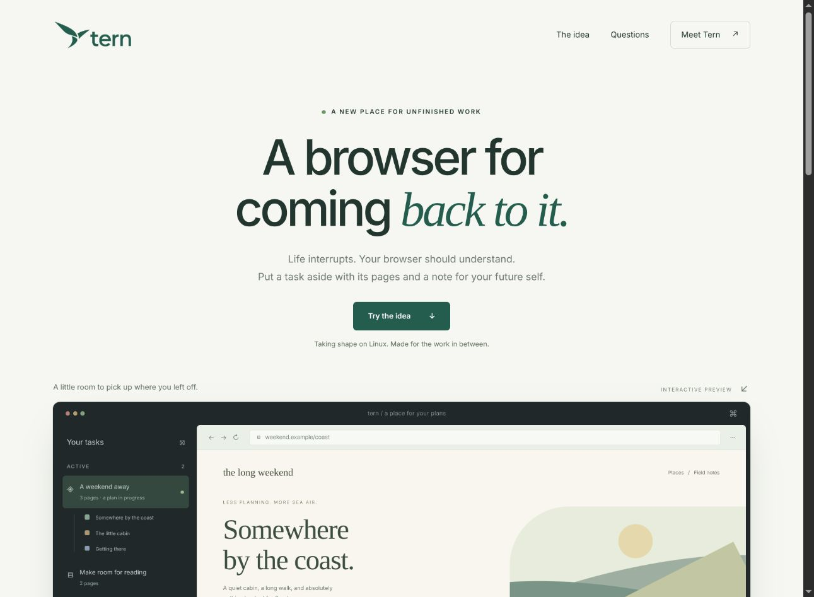
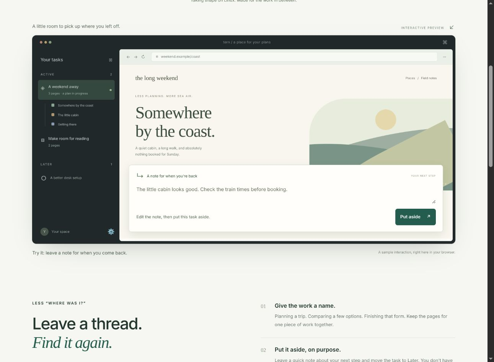
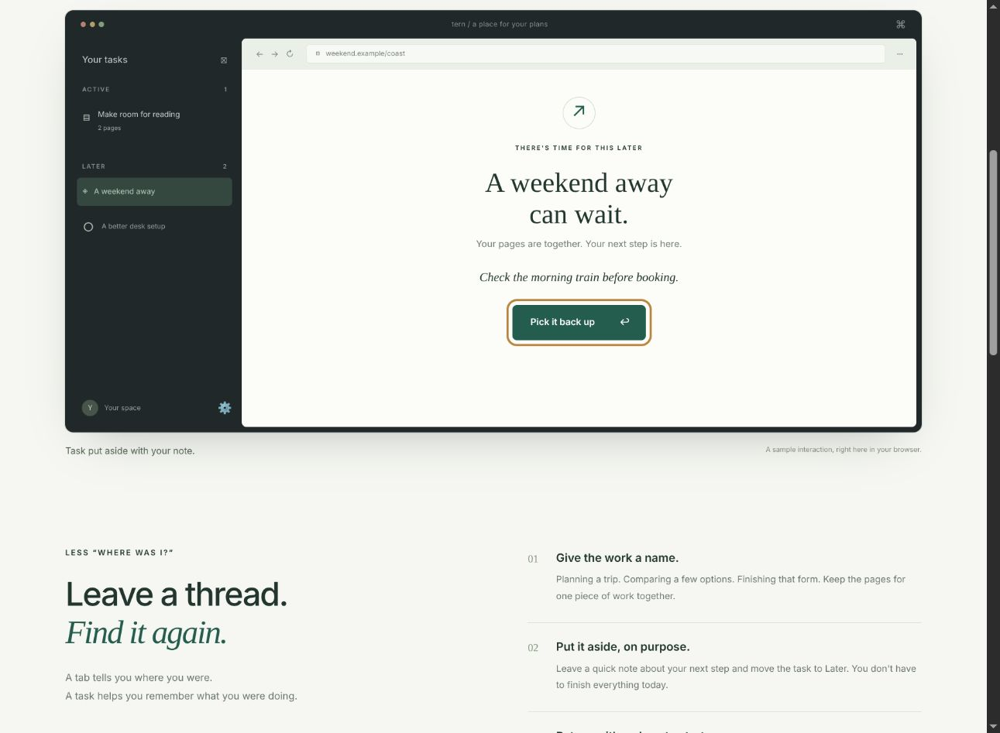
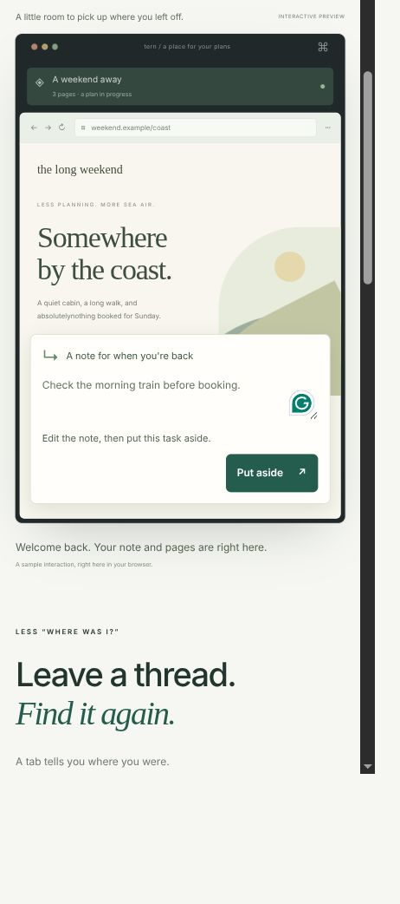
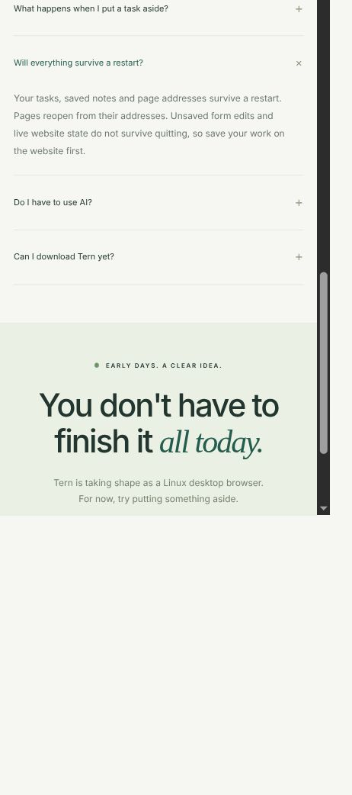
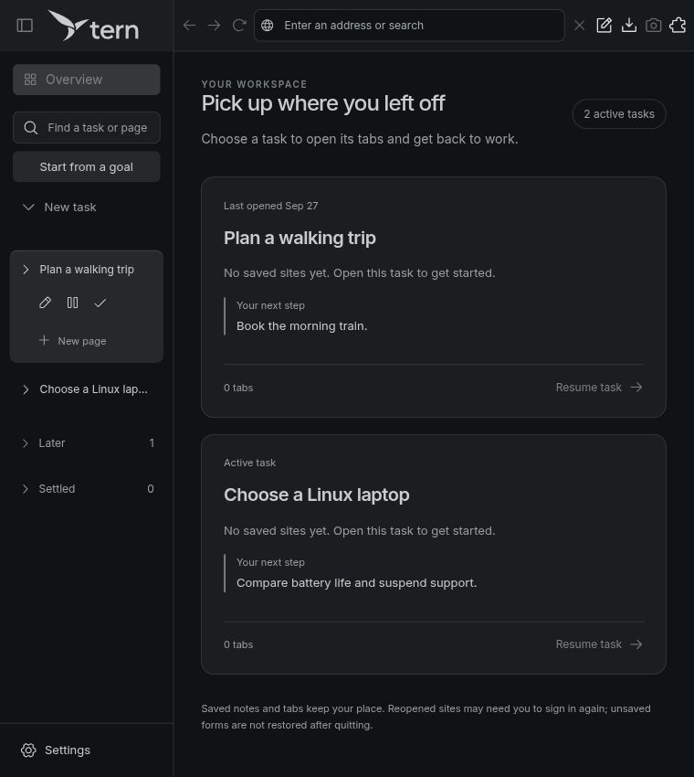

# Tern UX pass

Reviewed September 26–27, 2026. Covers the desktop task workflow and the marketing website. Changes are implemented locally, with Anime.js 4.5.0 pinned in both workspaces.

The core idea is easy to understand: give work a name, keep a next step, return later. The most useful improvements were clearer state changes and readable controls. Short motion now reinforces those actions.

## What changed

| Step | Flow | Health after this pass | Change |
| --- | --- | --- | --- |
| 1 | Desktop overview and search | Improved | Staggered card entrance, hover/focus cues, clear search, explicit no-results message, matches revealed in collapsed groups. |
| 2 | Open notes and save a next step | Improved | Panel entrance, saving label, checkmark confirmation, expanded state on toolbar button, focus returned when closing. |
| 3 | Put a task aside | Sound | Brief dialog entrance; Escape and immediate dismissal retained. |
| 4 | Website arrival and main action | Sound | Brief hero entrance, one-time section entrances, button arrow feedback, more readable alpha copy. |
| 5 | Edit the demo note | Improved | Larger text and a 44px minimum-height Put aside button. |
| 6 | Put aside and resume the demo | Improved | Task moves between Active and Later, counts respond, persistent status text confirms the change. |
| 7 | Use the demo on a narrow screen | Sound in captured viewport | Controls stack without horizontal overflow; note and action remain visible. |
| 8 | Read FAQ and download availability | Sound, release path still limited | Native disclosure behavior retained with a brief answer entrance. Public download remains unavailable. |
| 9 | Desktop in a narrow window | Improved | Selected task actions move below the title instead of squeezing it to a few characters. |

## Findings and evidence

### 1. Desktop overview and search

Saved next-step notes give the task cards useful context. Before this pass, cards appeared together without a transition, and an unsuccessful sidebar search produced an unexplained empty list. Search also left matching Later and Settled tasks inside collapsed groups. The implementation now explains an empty result, offers a clear button, and reveals matching groups.

The cards enter over 240ms, with a 35ms stagger capped at 175ms. Hover and keyboard focus share the same border and arrow feedback. Selecting a task remains immediate.

Remaining opportunity: the sidebar presents both "Start from a goal" and "New task" without explaining their different behavior. A brief description or a single entry point with a manual option would make first use clearer. Empty tasks also say "Resume task" despite having no pages.

### 2. Notes and save feedback

The existing form keeps per-task drafts and explicitly distinguishes saved and unsaved notes. The new confirmation adds a checkmark without relying on color alone. The toolbar button exposes its expanded state and has a visible selected treatment. Closing notes returns keyboard focus to that button.

Remaining opportunity: Goal, Next step, Suggested searches and Saved findings make this a long panel. In the captured saved-note state, the heading has scrolled away. A sticky heading or smaller sections would preserve orientation. Keyboard access was checked, but no screen-reader session was run.

### 3. Put aside dialog

The dialog already explains that pages stay live and the note is optional. Its short entrance now makes the change of context visible. Closing never waits for an animation, and focus, validation and Escape retain their existing behavior.

### 4. Website arrival

The hero has one clear primary action, "Try the idea", and keeps the same layout and brand. Motion is brief and runs once as sections enter view. Content is visible by default, so a missing animation cannot leave the page blank.

Remaining opportunity: "Meet Tern" leads to another invitation to try the demo. Once public builds exist, that position should explain the actual next step and platform availability.

### 5. Edit the demo note

The sample browser chrome can be small, but the real textarea and button need to be readable. Those controls now use larger text and the action has a 44px minimum height. The instruction explicitly invites editing before putting the task aside.

### 6. Put aside and return

The original status message lived inside the note card, which becomes hidden after putting a task aside. It now stays outside both views in a persistent live region. The task moves to its new sidebar position over 360ms; the count feedback lasts 220ms. The note and focus move to the new state immediately. Returning preserves the edited note.

### 7. Narrow website

The interactive controls stack, the full action remains available, and the captured layout has no horizontal overflow. Browser zoom made the requested 390px viewport report 433 CSS pixels; this is a narrow-layout check, not a physical-phone certification. Grammarly injected an icon into the textarea in this browser session.

### 8. FAQ and availability

The FAQ correctly distinguishes saved addresses from live website state. Its native details/summary controls remain in place, with an entrance applied only to the answer. The download limitation is explicit. Small decorative labels elsewhere on the page remain a readability risk; this pass concentrated on functional controls.

### 9. Narrow desktop

In the original narrow capture, selected task actions left room for only a few characters of the task name. Below 1000 CSS pixels, actions now occupy a second row. The regression check verifies that their bounds sit below the title.

## Motion and accessibility

Desktop entrances use scoped Anime.js effects, cleaned up when panels close or components unmount. They follow the library's [React integration](https://animejs.com/documentation/getting-started/using-with-react/) and [media-query support](https://animejs.com/documentation/scope/scope-parameters/mediaqueries/). The website tracks and cancels its active animations when motion preferences change or the demo is toggled again.

Both implementations honor reduced motion. Desktop checks include changing that preference during a panel entrance, verifying final opacity and transform, reopening panels, and operating dialogs with motion disabled. Website reduced-motion handling was inspected in code; its live browser session was checked with normal motion. Native desktop website-view bounds are not tweened.

## Validation and limits

- Desktop production build and TypeScript checks pass. Website production build passes.
- Task context, task creation and UX regression run: 18 passed, 2 skipped. Skipped cases require the pinned local AI model.
- Final targeted UX check passes after the narrow layout adjustment, including keyboard focus return, no-results recovery, matching a collapsed Later task and reduced-motion behavior.
- Website checked in Chrome with edited notes, keyboard pause/resume, focus transfer, anchor navigation, FAQ opening and narrow layout. Browser logs showed extension messages; these are separate from Tern's own scripts.
- Screenshots were captured and inspected during this run. Original captures are retained alongside the final captures. The window manager changed native window dimensions between runs, so desktop before/after images are flow evidence, not a pixel-aligned visual comparison.
- Screenshots cannot establish animation smoothness on low-end hardware or full accessibility compliance. Screen readers, all system themes, high zoom, and physical touch devices need separate checks. The custom desktop capture uses an isolated profile with sample tasks; it does not inspect personal browsing data.

The next design priority is clarifying the two desktop task-creation paths. Further animation should follow observed friction in that flow.
